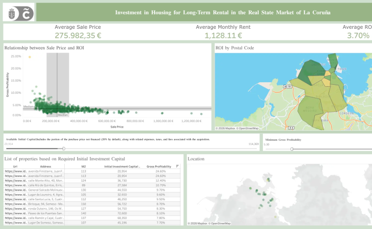

# Real_State_to_Rental_analysis
Real estate market analysis of the city of La Coruña, with the goal of investing in residential properties for long-term rental.

## Objective

The main objective is to identify properties in the city of La Coruña that allow us to maximize profitability by renting them out as long-term residential accommodations.

To achieve this, we divide the project into two main parts:

•	**Discovery**: Data analysis aimed at identifying insights that clarify which patterns we should focus on when looking for an investment property (guided by the current housing supply and rental demand).

•	**Reporting**: Creating a dashboard that enables detailed analysis of the most relevant metrics to determine whether a district or property meets our general criteria for profitability and available investment capital. It also provides access to the URLs of these properties, allowing the operator to conduct a deeper analysis.

## About the Dataset

The data was collected through web scraping (Octoparse app, CSV format) from two websites:

•	Idealista.com: A list of properties available for sale in La Coruña was collected (including URL, address, price, parking, number of rooms, and square meters).

•	Fotocasa.es: The average rental price per square meter for each district in La Coruña was collected.

The data was then cleaned, organized, and merged in the analytical datamart creation phase.

> [!NOTE]  
> Although a scraping system was used to collect the data, it is not automated.  
> There is no code in the notebooks that fetches data via an API. It is a one-time process carried out at the beginning of the project.

## Project Structure

The development of the Discovery project consists of the following structure:

- **Project design**: We define the objectives, KPIs, and seed questions.
- **Set up**: We load the data from its original files and save it in pickle format.
- **Creation of the Analytic Datamart**: Data cleaning, including review of data types and transformation of variables, handling of duplicates and null values, EDA of categorical and numerical variables, and finally, the construction of the analytic datamart.
- **Data preparation**: Creation of the synthetic variables necessary to shape the KPIs defined in the Project design phase.
- **Analysis**: Study of the final data and generation of insights.
- **Communication of results**: Executive report with the final conclusions.

As for the Reporting project, it consists of the following phases:

- **Project design**: We define the KPIs and charts that will be relevant. We specify the field type, formula, data source, type of visualization, granularity, and filters for each of the different objects.
- **Objects design**: We build each object separately and the final dashboard that brings them all together.

## To keep in mind

The rental price calculation was done by multiplying the average price per m² of the respective district by the m² of the specific property. However, this method results in rental values that are unrepresentative for properties with areas far from the average, as the relationship between rental price and m² is not linear.

Therefore, in the 04_Data_Preparation notebook, we excluded properties with areas over 150 m² (the median value) to avoid distorting the analysis.

Additionally, we removed entries for properties such as "House," "Townhouse," and similar types, applying the same m² criteria mentioned above.

## Highlights

I found a problem while building the dashboard as I needed. My idea was to place two objects that geolocated the apartments, either grouped by postal code or individually. The issue was that in the original files, I only had the address. The solution came with the Google Maps Platform API, specifically with its [Geocoding service](https://github.com/googlemaps/google-maps-services-python).

This service allows you to retrieve various geolocation data through the address, including latitude, longitude, and postal code.

The solution was to build a function that calls this service, then apply it to the address variable using `apply()`.

> [!NOTE]  
> API calls incur costs, so the API Key will likely be disabled to avoid unnecessary charges, as the project is considered complete.

## Conclusions

The final report with conclusions on the real estate market situation for investment in long-term rental housing can be found directly in the [Communication of results file](https://github.com/TonyGonzalezData/Real_State_for_rental_Analysis/blob/main/03_Notebooks/01_Development/06_Communication%20of%20Results.pdf).

As for the dashboard, you can access it at this public Tableau link: [Investment in Housing for Long-Term Rental in the Real State Market of La Coruña](https://public.tableau.com/app/profile/antonio.gonz.lez.pazos/viz/DashboardInvestmentinHousingforLong-TermRentalintheRealStateMarketofLaCorua/Dashboard)

> [!NOTE]  
> The project was developed using data dated October 29, 2024.
> 
> Therefore, some of the insights and conclusions are only relevant within this time frame.
> 
> The same applies to the Tableau Dashboard, which reflects the information from that date.
